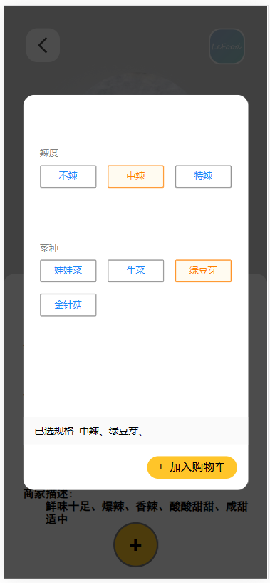

### 服务端

#### 登录界面：

输入服务端管理员的账号密码即可进入LeFood后台管理系统界面

#### 商品管理功能

LeFood服务端商品管理功能：此功能管理员可以管理商品信息，商品类型信息，以及商品的规格描述信息。默认查看上架商品，每种商品类型有多个商品信息。

点击商品图片或者商品的名称即看到商品的完整信息，并且可以对该商品信息进行修改

查看下架的商品

#### 商品的规格管理

#### 商品的类型管理

#### 订单管理：

当时用的同学的名字，所以进行会进行打码。

订单信息可以看到本月每天的流水走势以及今年每个季度的流水金额

管理员可以对订单进行处理

#### 用户信息：

#### ‘员工管理

### 客户端

客户端首页，在不登录的情况下可查看商品，但不可购买

#### 客户端注册与登录界面

点击登录即可切换为登录界面

点击商品图片即可进入商品购买界面

商品购买界面，点击加号可根据客户喜好选择规格

分类筛选

地址管理

订单支付功能未实现，订单页面也有很多未实现，例如申请退款、联系骑手、联系商家等功能。

个人中心也有很多功能未实现。同时也有一些bug存在。

